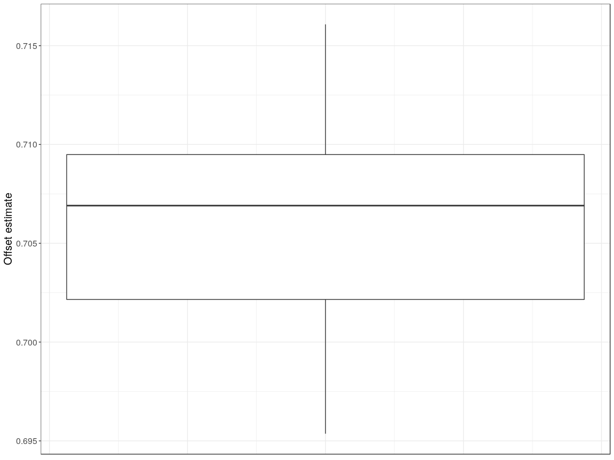
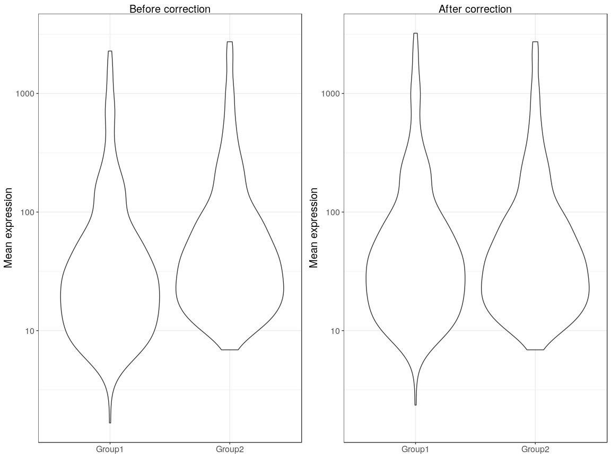
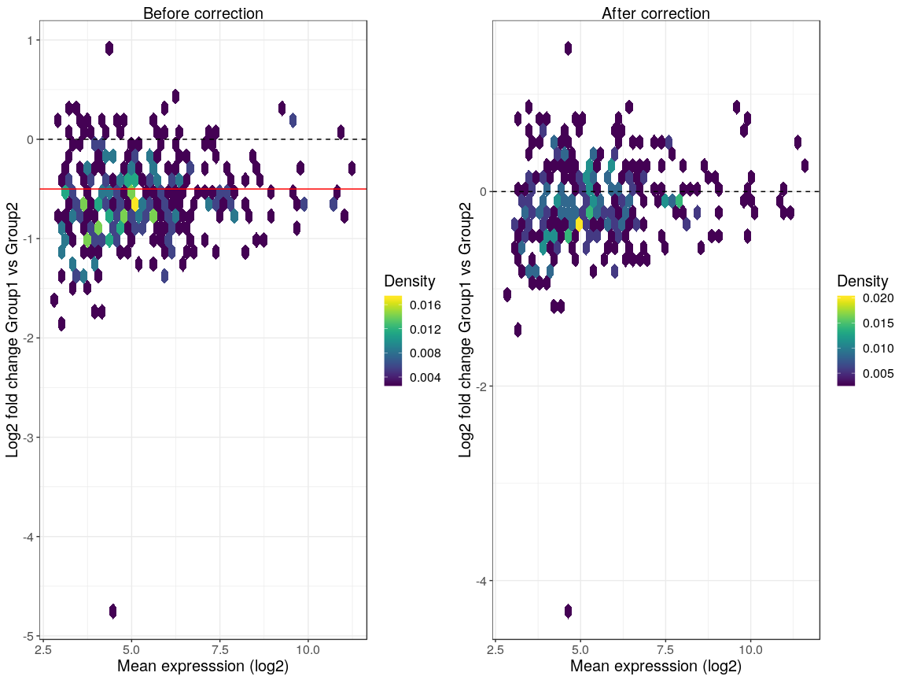

    suppressPackageStartupMessages({
        load_all()
        library("ggplot2")
    })

    ## Loading BASiCS

    data(ChainSCReg)
    data(ChainRNAReg)

    t <- theme_bw()
    t$text <- element_text(size = 15)
    t$plot.title <- element_text(hjust = 0.5)
    theme_set(theme_bw())

    os <- BASiCS_CorrectOffset(ChainSCReg, ChainRNAReg, Plot = FALSE)

    ## -------------------------------------------------------------
    ## Offset estimate: 0.7069
    ## (ratio Group1 vs Group2).
    ## To visualise its effect, please use 'PlotOffset = TRUE'.
    ## -------------------------------------------------------------

    de <- BASiCS_TestDE(ChainSCReg, ChainRNAReg, PlotOffset=FALSE, Plot=FALSE)

    ## -------------------------------------------------------------
    ## Log-fold change thresholds are now set in a log2 scale. 
    ## Original BASiCS release used a natural logarithm scale.

    ## -------------------------------------------------------------
    ## Offset estimate: 0.7069
    ## (ratio Group1 vs Group2).
    ## To visualise its effect, please use 'PlotOffset = TRUE'.
    ## -------------------------------------------------------------

    BASiCS_PlotOffset(os, Type = "offset estimate")

    BASiCS_PlotOffset(os, Type = "before-after")

    BASiCS_PlotOffset(os, Type = "MAPlot")

    ## Warning: Computation failed in `stat_binhex()`:
    ## "hbin" not resolved from current namespace (hexbin)

    ## Warning: Computation failed in `stat_binhex()`:
    ## "hbin" not resolved from current namespace (hexbin)

    DEPlots_ResultDE(de@Results[[1]])

    ## Warning: Computation failed in `stat_binhex()`:
    ## "hbin" not resolved from current namespace (hexbin)

    ## Warning: Computation failed in `stat_binhex()`:
    ## "hbin" not resolved from current namespace (hexbin)

    ## Warning: Removed 1 rows containing missing values (geom_hline).

    DEPlots_ResultDE(de@Results[[1]], Which = "MAPlot")

    ## Warning: Computation failed in `stat_binhex()`:
    ## "hbin" not resolved from current namespace (hexbin)

    DEPlots_ResultDE(de@Results[[1]], Which = "VolcanoPlot")

    ## Warning: Computation failed in `stat_binhex()`:
    ## "hbin" not resolved from current namespace (hexbin)

    ## Warning: Removed 1 rows containing missing values (geom_hline).

    DEPlots_ResultDE(de@Results[[1]], Which = "GridPlot")

    BASiCS_PlotDE(de)

    ## Warning: Computation failed in `stat_binhex()`:
    ## "hbin" not resolved from current namespace (hexbin)

    ## Warning: Computation failed in `stat_binhex()`:
    ## "hbin" not resolved from current namespace (hexbin)

    ## Warning: Removed 1 rows containing missing values (geom_hline).

    ## Warning: Computation failed in `stat_binhex()`:
    ## "hbin" not resolved from current namespace (hexbin)

    ## Warning: Computation failed in `stat_binhex()`:
    ## "hbin" not resolved from current namespace (hexbin)

    ## Warning: Removed 1 rows containing missing values (geom_hline).

    ## Warning in self$trans$transform(x): NaNs produced

    ## Warning: Transformation introduced infinite values in continuous x-axis

    ## Warning in self$trans$transform(x): NaNs produced

    ## Warning: Transformation introduced infinite values in continuous x-axis

    ## Warning: Removed 186 rows containing non-finite values (stat_binhex).

    ## Warning: Computation failed in `stat_binhex()`:
    ## "hbin" not resolved from current namespace (hexbin)

    ## Warning: Removed 4 rows containing missing values (geom_point).

    ## Warning: Computation failed in `stat_binhex()`:
    ## "hbin" not resolved from current namespace (hexbin)

    ## Warning: Removed 1 rows containing missing values (geom_hline).

    BASiCS_PlotDE(de, Which = "MAPlot")

    ## Warning: Computation failed in `stat_binhex()`:
    ## "hbin" not resolved from current namespace (hexbin)

    ## Warning: Computation failed in `stat_binhex()`:
    ## "hbin" not resolved from current namespace (hexbin)

    ## Warning in self$trans$transform(x): NaNs produced

    ## Warning: Transformation introduced infinite values in continuous x-axis

    ## Warning in self$trans$transform(x): NaNs produced

    ## Warning: Transformation introduced infinite values in continuous x-axis

    ## Warning: Removed 186 rows containing non-finite values (stat_binhex).

    ## Warning: Computation failed in `stat_binhex()`:
    ## "hbin" not resolved from current namespace (hexbin)

    ## Warning: Removed 4 rows containing missing values (geom_point).

    BASiCS_PlotDE(de, Which = "VolcanoPlot")

    ## Warning: Computation failed in `stat_binhex()`:
    ## "hbin" not resolved from current namespace (hexbin)

    ## Warning: Removed 1 rows containing missing values (geom_hline).

    ## Warning: Computation failed in `stat_binhex()`:
    ## "hbin" not resolved from current namespace (hexbin)

    ## Warning: Removed 1 rows containing missing values (geom_hline).

    ## Warning: Computation failed in `stat_binhex()`:
    ## "hbin" not resolved from current namespace (hexbin)

    ## Warning: Removed 1 rows containing missing values (geom_hline).

    BASiCS_PlotDE(de, Which = "GridPlot")

