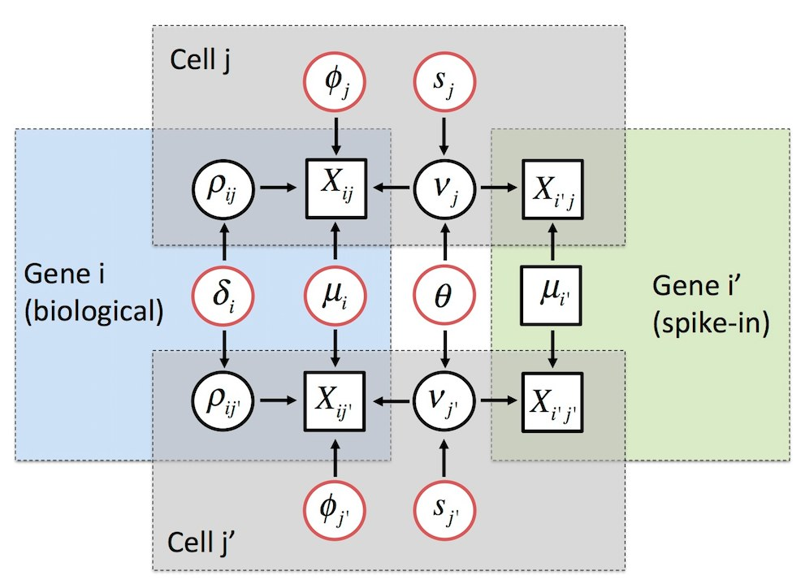

<!--
%\VignetteIndexEntry{Introduction to BASiCS}
%\VignettePackage{BiocStyle}
%\VignetteEngine{knitr::knitr}
-->

```{r, echo=FALSE, results="hide", message=TRUE}
require(knitr)
opts_chunk$set(error=FALSE, message=FALSE, warning=FALSE)
```

```{r style, echo=FALSE, results='asis'}
BiocStyle::markdown()
```

```{r library, echo=FALSE}
library(BASiCS)
```

# Introduction to BASiCS

Package: `r Biocpkg("BASiCS")` <br />
Authors: Catalina Vallejos (cnvallej@uc.cl) and Nils Eling (eling@ebi.ac.uk) <br />
Compilation date: `r Sys.Date()`

***

# Introduction 

Single-cell mRNA sequencing can uncover novel cell-to-cell heterogeneity in gene expression levels within seemingly homogeneous populations of cells. However, these experiments are prone to high levels of technical noise, creating new challenges for identifying genes that show genuine heterogeneous expression within the group of cells under study. 

BASiCS (**B**ayesian **A**nalysis of **Si**ngle-**C**ell **S**equencing data) is an integrated Bayesian hierarchical model that propagates statistical uncertainty by simultaneously performing data normalisation (global scaling), technical noise quantification and two types of **supervised** downstream analyses: 

- **For a single group of cells** [1]: BASiCS provides a criterion to identify highly (and lowly) variable genes within the group. 

- **For two (or more) groups of cells** [2]: BASiCS allows the identification of differentially expressed genes between the groups. As in traditional differential expression tools, BASiCS can uncover changes in mean expression between the groups. Besides this, BASiCS can also uncover changes in *over-dispersion* --- a measure for the residual cell-to-cell variation that is observed after accounting for technical noise. This feature has led, for example, to novel insights in the context of immune cells across aging [3].

In both cases, a probabilistic output is provided, with posterior probability thresholds calibrated through the expected false discovery rate (EFDR) [4].

Currently, BASiCS relies on the use of **spike-in genes** --- that are artificially introduced to each cell's lysate --- to perform these analyses. 

**Important: BASiCS has been designed in the context of supervised experiments where the groups of cells (e.g. experimental conditions, cell types) under study are known a priori (e.g. case-control studies). Therefore, we DO NOT advise the use of BASiCS in unsupervised settings where the aim is to uncover sub-populations of cells through clustering.**

A brief description for the statistical model implemented in BASiCS is provided in the "Methodology" section of this document. 

***

# Quick start

### The input dataset

The input dataset for BASiCS must be stored as an `SummarizedExperiment` object (see `r Biocpkg("SummarizedExperiment")` package). 

The `newBASiCS_Data` function can be used to create the input data object based on the following information:

* `Counts`: a matrix of raw expression counts with dimensions $q$ times $n$. Within this matrix, $q_0$ rows must correspond to biological genes and $q-q_0$ rows must correspond to technical spike-in genes. Gene names must be stored as `rownames(Counts)`.

* `Tech`: a vector of `TRUE`/`FALSE` elements with length $q$. If `Tech[i] = FALSE` the gene `i` is biological; otherwise the gene is spike-in. This vector must be specified in the same order of genes as in the `Counts` matrix. 

* `SpikeInfo`: a `data.frame` with $q-q_0$ rows. First column must contain the names associated to the spike-in genes (as in `rownames(Counts)`). Second column must contain the input number of molecules for the spike-in genes (amount per cell).

* `BatchInfo` (optional): vector of length $n$ to indicate batch structure (whenever cells have been processed using multiple batches). 

For example, the following code simulates a dataset with 50 genes (40 biological and 10 spike-in) and 40 cells. 

```{r ExampleDataTest}
set.seed(1)
Counts = Counts = matrix(rpois(50*40, 2), ncol = 40)
rownames(Counts) <- c(paste0("Gene", 1:40), paste0("Spike", 1:10))
Tech = c(rep(FALSE,40),rep(TRUE,10))
set.seed(2)
SpikeInput = rgamma(10,1,1)
SpikeInfo <- data.frame("SpikeID" = paste0("Spike", 1:10), "SpikeInput" = SpikeInput)

# No batch structure
DataExample = newBASiCS_Data(Counts, Tech, SpikeInfo)

# With batch structure
DataExample = newBASiCS_Data(Counts, Tech, SpikeInfo, 
                             BatchInfo = rep(c(1,2), each = 20)) 
```

Note: scRNA-seq datasets typically require quality control filtering before performing the analysis. This is in order to remove cells and/or transcripts with very low expression counts. The function `BASiCS_Filter` performs this filtering. For examples, refer to `help(BASiCS_Filter)`.  

Note: the `r Biocpkg("scater")` package provides enhanced functionality for the pre-processing of scRNA-seq datasets. 

To convert an existing `SummarizedExperiment` object (`Data`) into one that can be used within BASiCS, meta-information must be stored in the object.

* `colData(Data)=Tech`: the logical vector indicating biological/technical genes (see above) must be stored in the `colData` slot.

* `metadata(Data)`: the `SpikeInfo` and `BatchInfo` objects are stored in the `metadata` slot of the `SummarizedExperiment` object: `metadata(Data)=list(SpikeInput = SpikeInfo[,2], BatchInfo = BatchInfo)`. Once the additional information is included, the object can be used within BASiCS.

<span style="color:red"> TO-DO: REPLACE THIS BY THE NEW SC OBJECT. AFTERWARDS, CHECK THAT APPROPRIATE CHECKS ARE PERFORMED TO GUARANTEE THAT THE METADATA IS CORRECTLY PROVIDED. </span> 

### Running the MCMC sampler

Parameter estimation is performed using the `BASiCS_MCMC` function. Essential parameters for running this algorithm are: 

* `N`: total number of iterations
* `Thin`: length of the thining period (i.e. only every `Thin` iterations will be stored in the output of the `BASiCS_MCMC`)
* `Burn`: length of burn-in period (i.e. the initial `Burn` iterations that will be discarded from the output of the `BASiCS_MCMC`)

If the optional parameter `PrintProgress` is set to `TRUE`, the R console will display the progress of the MCMC algorithm. For other optional parameters refer to `help(BASiCS_MCMC)`. Hereafter, we illustrate the usage of `BASiCS_MCMC` using a built-in synthetic dataset.

```{r quick-start-MCMC}
Data <- makeExampleBASiCS_Data()
Chain <- BASiCS_MCMC(Data = Data, N = 1000, Thin = 10, Burn = 500, 
                     PrintProgress = FALSE)
```

**Important remarks:**

- Please ensure the acceptance rates displayed in the console output of `BASiCS_MCMC` are around 0.44. If they are too far from this value, you should increase the number of iterations. 

- It is **essential** to assess the convergence of the MCMC algorithm **before** continuing with downstream analyses. For guidance regarding this step, refer to the 'Convergence assessment' section of this vignette

Typically, setting `N=20000`, `Thin=20` and `Burn=10000` leads to stable results. 

<span style="color:red"> NOTE: DEFAULT PRIOR FOR GAMMA DEFINED BY LOG-NORMAL DISTRIBUTION NOW. THIS IS REQUIRED FOR DIFFERENTIAL DISPERSION TESTS. </span> 

### Analysis for a single group of cells

We illustrate this analysis using a small extract from the MCMC chain obtained in [2] when analysing the single cell samples provided in [5]. This is included within `BASiCS` as the `ChainSC` dataset. 

```{r LoadSingleData}
data(ChainSC)
```

The following code is used to identify **highly variable genes (HVG)** and **lowly variable genes (LVG) ** within these cells. The `VarThreshold` parameter sets a lower threshold for the proportion of variability that is assigned to the biological component (`Sigma`). In the examples below:

- HVG are defined as those genes for which **at least** 60\% of their total variability is attributed to the biological variability component. 
- LVG are defined as those genes for which **at most** 40\% of their total variability is attributed to the biological variability component.

For each gene, these functions return posterior probabilities as a measure of HVG/LVG evidence. A cut-off value for these posterior probabilities is set by controlling EFDR (defaul option: `EviThreshold` defined such that EFDR = 0.05).

```{r quick-start-HVGdetection, fig.height = 6, fig.width = 6}
par(mfrow = c(2,2))
HVG <- BASiCS_DetectHVG(ChainSC, VarThreshold = 0.6, Plot = TRUE)
LVG <- BASiCS_DetectLVG(ChainSC, VarThreshold = 0.2, Plot = TRUE)
```

To access the results of these tests, please use. 

```{r quick-start-HVGdetectionTable}
head(HVG$Table)
head(LVG$Table)
```

```{r quick-start-HVGdetectionPlot}
SummarySC <- Summary(ChainSC)
plot(SummarySC, Param = "mu", Param2 = "delta", log = "xy")
with(HVG$Table[HVG$Table$HVG == TRUE,], points(Mu, Delta))
with(LVG$Table[LVG$Table$LVG == TRUE,], points(Mu, Delta))
```

<span style="color:red"> Note: this criteria for threshold choice is new. Original version defined  `EviThreshold` such that EFDR = EFNR. However, this 
is more consistent with the differential tests and its more stable 
(sometimes, we couldn't find a threshold such that EFDR = EFNR). </span>

### Analysis for two groups of cells 

To illustrate the use of the differential mean expression and differential over-dispersion tests between two cell populations, we use extracts from the MCMC chains obtained in [2] when analysing the [5] dataset (single cells vs pool-and-split samples). These were obtained by independently running the `BASiCS_MCMC` function for each group of cells. 

```{r quick-start-LoadBothData}
data(ChainSC)
data(ChainRNA)
```

```{r quick-start-TestDE, fig.width=10, fig.height=5}
Test <- BASiCS_TestDE(Chain1 = ChainSC, Chain2 = ChainRNA,
                      GroupLabel1 = "SC", GroupLabel2 = "PaS",
                      EpsilonM = log2(1.5), EpsilonD = log2(1.5),
                      EFDR_M = 0.05, EFDR_D = 0.05,
                      OffSet = TRUE, OffsetPlot = TRUE, Plot = TRUE)
```

In `BASiCS_TestDE`, `EpsilonM` sets the log2 fold change (log2FC) in expression ($\mu$) and `EpsilonD` the log2FC in over-dispersion ($\delta$). As a default option: `EpsilonM = EpsilonD = log2(1.5)` (i.e. 
50\% increase). To adjust for differences in overall RNA content, an internal offset correction is performed when `OffSet=TRUE`. This is the recommended default.  

**Due to the confounding between mean and over-dispersion that is typically observed in scRNA-seq datasets, we only assess changes in over-dispersion for those genes in which the mean does not change between the groups.**

<span style="color:red"> Note: previous versions of BASiCS used natural logarithm instead </.span>

The resulting output list can be displayed using

```{r quick-start-DE, results='hide', eval = FALSE}
head(Test$TableMean)
head(Test$TableDisp)
```

<span style="color:red"> SHOULD WE SEPARATE TESTS FOR MEAN AND DISPERSION 
INTO TWO SEPARATE FUNCTIONS? </span> 

# Additional details

### Storing and loading MCMC chains

To externally store the output of `BASiCS_MCMC` (recommended), additional parameters `StoreChains`, `StoreDir` and `RunName` are required. For example:

```{r MCMCNotRun}
Data <- makeExampleBASiCS_Data()
Chain <- BASiCS_MCMC(Data, N = 1000, Thin = 10, Burn = 500, 
                     PrintProgress = FALSE, StoreChains = TRUE, 
                     StoreDir = tempdir(), RunName = "Example")
```

In this example, the output of `BASiCS_MCMC` will be stored as a `BASiCS_Chain` object in the file "chain_Example.Rds", within the `tempdir()` directory. 

To load pre-computed MCMC chains, 

```{r LoadChainNotRun}
Chain <- BASiCS_LoadChain("Example", StoreDir = tempdir()) 
```

## Convergence assessment

To assess convergence of the chain, the convergence diagnostics provided by the package `coda` can be used. Additionally, the chains can be visually inspected. For example:

```{r Traceplots, fig.height = 3, fig.width = 6}
plot(Chain, Param = "mu", Gene = 1, log = "y")
plot(Chain, Param = "phi", Cell = 1)
```

In the figures above:

- Left panels show traceplots for the chains
- Right panels show the autocorrelation function (see `?acf`)

<!---<span style="color:red"> TO-DO 14: ADD ACF TO THESE PLOTS </span>---> 

## Summarising the posterior distribution

To access the MCMC chains associated to individual parameter use the function `displayChainBASiCS`. For example, 

```{r AccessChains}
displayChainBASiCS(Chain, Param = "mu")[1:5,1:5]
```

As a summary of the posterior distribution, the function `Summary` calculates posterior medians and the High Posterior Density (HPD) intervals for each model parameter. As a default option, HPD intervals contain 0.95 probability. 

```{r Summary}
ChainSummary <- Summary(Chain)
```

The function `displaySummaryBASiCS` extract posterior summaries for individual parameters. For example

```{r SummaryExample}
head(displaySummaryBASiCS(ChainSummary, Param = "mu"))
```


The following figures display posterior medians and the corresponding HPD 95% intervals for gene-specific parameters $\mu_i$ (mean) and $\delta_i$ (over-dispersion)

```{r OtherHPD, fig.width = 7, fig.height = 7}
par(mfrow = c(2,2))
plot(ChainSummary, Param = "mu", main = "All genes", log = "y")
plot(ChainSummary, Param = "mu", Genes = 1:10, main = "First 10 genes")
plot(ChainSummary, Param = "delta", main = "All genes")
plot(ChainSummary, Param = "delta", Genes = c(2,5,10,50), main = "5 customized genes")
```

It is also possible to obtain similar summaries for the normalising constants $\phi_j$ and $s_j$. 

```{r Normalisation, fig.width = 7, fig.height = 3.5}
par(mfrow = c(1,2))
plot(ChainSummary, Param = "phi")
plot(ChainSummary, Param = "s", Cells = 1:5)
```

Finally, it is also possible to create a scatterplot of posterior estimates for gene-specific parameters. Typically, this plot will exhibit the confounding effect that is observed between mean and over-dispersion. 

```{r DispVsExp, fig.width = 7, fig.height = 3.5}
par(mfrow = c(1,2))
plot(ChainSummary, Param = "mu", Param2 = "delta", log = "x", SmoothPlot = FALSE)
plot(ChainSummary, Param = "mu", Param2 = "delta", log = "x", SmoothPlot = TRUE)
```

The option `SmoothPlot = TRUE` is generally recommended as this plot will contain thousands of genes when analysing real datasets. 

## Normalisation and removal of technical variation

It is also possible to produce a matrix of normalised and denoised expression counts for which the effect of technical variation is removed. For this purpose, we implemented the function `BASiCS_DenoisedCounts`. For each gene $i$ and cell $j$ this function returns

$$ x^*_{ij} = \frac{ x_{ij} } {\hat{\phi}_j \hat{\nu}_j}, $$

where $x_{ij}$ is the observed expression count of gene $i$ in cell $j$, $\hat{\phi}_j$ denotes the posterior median of $\phi_j$ and $\hat{\nu}_j$ is the posterior median of $\nu_j$.

```{r DenoisedCounts}
DenoisedCounts = BASiCS_DenoisedCounts(Data = Data, Chain = Chain)
DenoisedCounts[1:5, 1:5]
```

Alternativelly, the user can compute the normalised and denoised expression rates underlying the expression of all genes across cells using `BASiCS_DenoisedRates`. The output of this function is given by 

$$ \Lambda_{ij} = \hat{\mu_i} \hat{\rho}_{ij},  $$

where $\hat{\mu_i}$ represents the posterior median of $\mu_j$ and $\hat{\rho}_{ij}$ is given by its posterior mean (Monte Carlo estimate based on the MCMC sample of all model parameters).

```{r DenoisedProp}
DenoisedRates = BASiCS_DenoisedRates(Data = Data, Chain = Chain, Propensities = FALSE)
DenoisedRates[1:5, 1:5]
```

Alternative, denoised expression propensities $\hat{\rho}_{ij}$ can also be extracted

```{r DenoisedRates}
DenoisedProp = BASiCS_DenoisedRates(Data = Data, Chain = Chain, Propensities = TRUE)
DenoisedProp[1:5, 1:5]
```

<span style="color:red"> TO-DO: DECIDE WHETHER IT MAKES SENSE TO HAVE BOTH OPTIONS </span>

<span style="color:red"> TO-DO: IMPLEMENT THIS FUNCTION IN C++ SO THAT IS IT FAST </span>

# Methodology

We first describe the model introduced in [1], which relates to a single group of cells. 

Throughout, we consider the expression counts of $q$ genes, where $q_0$ are expressed in the population of cells under study (biological genes) and the remaining $q-q_0$ are extrinsic spike-in (technical) genes. Let $X_{ij}$ be a random variable representing the expression count of a gene $i$ in cell $j$  ($i=1,\ldots,q$; $j=1,\ldots,n$). BASiCS is based on the following hierarchical model:
$$X_{ij}  \big| \mu_i, \phi_j, \nu_j, \rho_{ij} \sim \left\{ \begin{array}{ll} \mbox{Poisson}(\phi_j \nu_j \mu_i \rho_{ij}), \mbox{  for }i=1,\ldots,q_0, j=1,\ldots,n \\ \mbox{Poisson}(\nu_j \mu_i), \mbox{  for }i=q_0+1,\ldots,q, j=1,\ldots,n, \end{array} \right.$$

where $\nu_j$ and $\rho_{ij}$ are mutually independent random effects such that $\nu_j|s_j,\theta \sim \mbox{Gamma}(1/\theta,1/ (s_j \theta))$ and $\rho_{ij} | \delta_i \sim \mbox{Gamma} (1/\delta_i,1/\delta_i)$[^footnoteGamma]. 

A graphical representation of this model is displayed below. This is based on the expression counts of 2 genes ($i$: biological and $i'$: technical) at 2 cells ($j$ and $j'$). Squared and circular nodes denote known observed quantities (observed expression counts and added number of spike-in mRNA molecules) and unknown elements, respectively. Whereas black circular nodes represent the random effects that play an intermediate role in our hierarchical structure, red circular nodes relate to unknown model parameters in the top layer of hierarchy in our model. Blue, green and grey areas highlight elements that are shared within a biological gene, technical gene or cell, respectively. 

<!--  -->

\centerline{\includegraphics[height=4in]{./BASiCS_DAG.jpg}}

In this setting, the key parameters to be used for downstream analyses are:

* $\mu_i$: mean expression parameter for gene $i$ in the group of cells under study. In case of the spike-in technical genes, $\mu_i$ is assumed to be known and equal to the input number of molecules of the corresponding spike-in gene).

* $\delta_i$: over-dispersion parameter for gene $i$, controlling the strength of the biological cell-to-cell expression heterogeneity of a gene $i$ across the population of cells under study.

Additional (nuisance) parameters are interpreted as follows:

* $\phi_j$: cell-specific normalizing constants related to differences in mRNA content (identifiability constrain: $\sum_{j=1}^n \phi_j = n$). 

* $s_j$: cell-specific normalizing constants related to technical cell-specific biases (for more details regarding this interpretation see [6]).

* $\theta$: technical over-dispersion parameter, controlling the strenght of cell-to-cell technical variability. 

When cells from the same group are processed in multiple sequencing batches, this model is extended so that the technical over-dispersion parameter $\theta$ is batch-specific. This extension allows a different strenght of technical noise to be inferred for each batch of cells.  

[^footnoteGamma]: We parametrize the Gamma distribution such that if $X \sim \mbox{Gamma}(a,b)$, then $\mbox{E}(X)=a/b$ and $\mbox{var}(X)=a/b^2$.

In [2], this model has been extended to cases where multiple groups of cells are under study. This is achieved by assuming gene-specific parameters to be also group-specific. Based on this setup, evidence of differential expression is quantified through log-fold changes of gene-specific parameters (mean and over-dispersion) between the groups. 

More details regarding the model setup, prior specification and implementation are described in [1] and [2]. 

***

# Acknowledgements

We thank several members of the Marioni laboratory (EMBL-EBI; CRUK-CI) for support and discussions throughout the development of this R library. In particular, we are grateful to Aaron Lun (@LTLA, CRUK-CI) for advise and support during the preparation the Bioconductor submission. 

We also acknowledge feedback and contributions from (Github aliases provided within parenthesis): Ben Dulken (bdulken), Chang Xu (xuchang116), Danilo Horta (Horta), Dmitriy Zhukov (dvzhukov), Jens Preu&szlig;ner (jenzopr), Joanna Dreux (Joannacodes), Kevin Rue-Albrecht (kevinrue), Luke Zappia (lazappi), Simon Anders (s-andrews), Yongchao Ge and Yuan Cao (yuancao90), among others. 

This work has been funded by the MRC Biostatistics Unit (MRC grant no. MRC_MC_UP_0801/1; Catalina Vallejos and Sylvia Richardson), EMBL European Bioinformatics Institute (core European Molecular Biology Laboratory funding; Catalina Vallejos, Nils Eling and John Marioni), CRUK Cambridge Institute (core CRUK funding; John Marioni) and The Alan Turing Institute (EPSRC grant no. EP/N510129/1; Catalina Vallejos). 

***

# References

[1] Vallejos CA, Marioni JCM and Richardson S (2015) BASiCS: Bayesian analysis of single-cell sequencing data. *PLoS Computational Biology* 11 (6), e1004333.

[2] Vallejos CA, Richardson S and Marioni JCM (2016) Beyond comparisons of means: understanding changes in gene expression at the single-cell level. *Genome Biology* 17 (1), 1-14.

[3] Martinez-Jimenez CP, Eling N, Chen H, Vallejos CA, Kolodziejczyk AA, Connor F, Stojic L, Rayner TF, Stubbington MJT, Teichmann SA, de la Roche M, Marioni JC and Odom DT (2017) Aging increases cell-to-cell transcriptional variability upon immune stimulation. *Science* 355 (6332), 1433-1436.

[4] Newton MA, Noueiry A, Sarkar D, Ahlquist P (2004) Detecting differential gene expression with a semiparametric hierarchical mixture method. *Biostatistics* 5 (2), 155–76.

[5] Gr&uuml;n D, Kester L, van Oudenaarden A (2014) Validation of noise models for single-cell transcriptomics. *Nature Methods* 11 (6), 637–40.

[6] Vallejos CA, Risso D, Scialdone A, Dudoit S and Marioni JCM (2017) Normalizing single-cell RNA-sequencing data: challenges and opportunities. *Nature Methods* 14, 565-571.

[7] Roberts GO and Rosenthal JS (2009). Examples of adaptive MCMC. *Journal of Computational and Graphical Statistics* 18: 349-367. 

# Session information

```{r SessionInfo}
sessionInfo()
```
