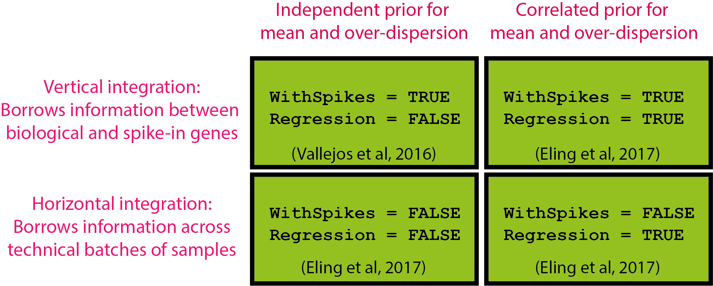

```{r, echo=FALSE, results="hide", message=FALSE}
require(knitr)
opts_chunk$set(error=FALSE, message=FALSE, warning=FALSE, dpi = 30)
knitr::opts_chunk$set(dev="png")
```

```{r library, echo=FALSE}
library(BASiCS)
library(BiocStyle)
```

# Introduction 

Single-cell mRNA sequencing can uncover novel cell-to-cell heterogeneity in gene 
expression levels within seemingly homogeneous populations of cells. However, 
these experiments are prone to high levels of technical noise, creating new 
challenges for identifying genes that show genuine heterogeneous expression 
within the group of cells under study. 

 

BASiCS (**B**ayesian **A**nalysis of **Si**ngle-**C**ell **S**equencing data) 
is an integrated Bayesian hierarchical model that propagates statistical 
uncertainty by simultaneously performing data normalisation (global scaling), 
technical noise quantification and two types of **supervised** downstream 
analyses: 

1. **For a single group of cells** [@vallejos2015basics]: BASiCS provides a 
criterion to identify highly (and lowly) variable genes within the group. 
2. **For two (or more) groups of cells**: BASiCS allows the identification 
of changes in gene expression between the groups. As in traditional 
differential expression tools, BASiCS can uncover changes in mean expression 
between the groups. Besides this, BASiCS can also uncover changes in gene 
expression variability in terms of: 
  a. **Over-dispersion** [@vallejos2016beyond] --- a measure for the excess of 
  cell-to-cell variability that is observed with respect to Poisson sampling, 
  after accounting for technical noise. This feature has led, for example, to 
  novel insights in the context of immune cells across aging 
  [@martinez2017aging]. However, due to the strong mean/over-dispersion 
  confounding that is typically observed for scRNA-seq datasets, the assessment 
  of changes in over-dispersion is restricted to genes for which mean expression 
  does not change between the groups. 
  b. **Residual over-dispersion** [@eling2018correcting] --- a residual measure of 
  variability given by departures with respect to a global mean/over-dispersion 
  trend. Positive residual over-dispersion indicates that a gene exhibits more 
  variation than expected relative to genes with similar expression levels;
  negative residual over-dispersion suggests less variation than expected.
  To use this feature, please set `Regression = TRUE` as a function parameter 
  in `BASiCS_MCMC`. 

In all cases, a probabilistic output is provided and a decision rule is
calibrated using the expected false discovery rate (EFDR) [@newton2004detecting].

A brief description for the statistical model implemented in BASiCS is 
provided in Section \@ref(methodology) of this document. The original 
implementation of BASiCS [@vallejos2015basics] requires the use of **spike-in** 
molecules --- that are artificially introduced to each cell's lysate 
--- to perform these analyses. More recently, @eling2018correcting extendeded 
BASiCS to also address datasets for which spikes-ins are not available 
(see Section \@ref(alternative-implementation-modes)). To use this feature, 
please set `WithSpikes = FALSE` as a function parameter in `BASiCS_MCMC`. 

**Important**: BASiCS has been designed in the context of supervised experiments 
where the groups of cells (e.g. experimental conditions, cell types) under study 
are known a priori (e.g. case-control studies). Therefore, we DO NOT advise the 
use of BASiCS in unsupervised settings where the aim is to uncover 
sub-populations of cells through clustering.

***

# Quick start

Parameter estimation is performed using the `BASiCS_MCMC` function. Downstream
analyses implemented in BASiCS rely on appropriate post-processing of the 
output returned by `BASiCS_MCMC`. Essential parameters for running 
`BASiCS_MCMC` are: 

* `Data`: a `SingleCellExperiment` object created as in Section 
\@ref(the-input-dataset)
* `N`: total number of iterations
* `Thin`: length of the thining period (i.e. only every `Thin` 
iterations will be stored in the output of the `BASiCS_MCMC`)
* `Burn`: length of burn-in period (i.e. the initial `Burn` 
iterations that will be discarded from the output of the `BASiCS_MCMC`)
* `Regression`: if this parameter is set equal to `TRUE`, the regression 
BASiCS model will be used [@eling2018correcting]. The latter infers a global 
regression trend between mean expression and over-dispersion parameters. This
trend is subsequently used to derive a *residual over-dispersion* measure that 
is defined as departures with respect to this trend. **This is now the 
recommended default setting for BASiCS***.

If the optional parameter `PrintProgress` is set to `TRUE`, the R
console will display the progress of the MCMC algorithm. 
For other optional parameters refer to `help(BASiCS_MCMC)`. 

Here, we illustrate the usage of `BASiCS_MCMC` using a built-in 
synthetic dataset.

**NOTE: WE USE A SMALL NUMBER OF ITERATIONS FOR ILLUSTRATION PURPOSES ONLY.
LARGER NUMBER OF ITERATIONS ARE USUALLY REQUIRED TO ACHIEVE CONVERGENCE. OUR
RECOMMENDED SETTING IS `N=20000`, `Thin=20` and `Burn=10000`.**


```{r quick-start-MCMC}
Data <- makeExampleBASiCS_Data()
Chain <- BASiCS_MCMC(Data = Data, N = 1000, Thin = 10, Burn = 500, 
                     PrintProgress = FALSE, Regression = TRUE)
```

As a default, the code above runs the original implementation mode of BASiCS 
(spikes without regression; see Section \@ref(alternative-implementation-modes)).
To use the regression BASiCS model [@eling2018correcting], please set 
`Regression = TRUE`. To use the no-spikes implementation of BASiCS, please add 
`WithSpikes = FALSE` as an additional parameter. 

The `Data` and `Chain` (a `BASiCS_Chain` object) objects created by the code
above can be use for subsequent downstream analyses. See Section 
\@ref(analysis-for-a-single-group-of-cells) for highly/lowly variable gene
detection (single group of cells, see also functions `BASiCS_DetectHVG` and 
`BASiCS_DetectLVG`) and Section \@ref(analysis-for-two-groups-of-cells) for 
differential expression analyses (two groups of cells, see also function 
`BASiCS_TestDE`). 

**Important remarks:**

- Please ensure the acceptance rates displayed in the console output of 
`BASiCS_MCMC` are around 0.44. If they are too far from this value, you 
should increase `N` and `Burn`. 

- It is **essential** to assess the convergence of the MCMC algorithm 
**before** performing downstream analyses. For guidance regarding this step, 
refer to the 'Convergence assessment' section of this vignette

Typically, setting `N=20000`, `Thin=20` and `Burn=10000` leads to 
stable results. 

# Complete workflow

## The input dataset

The input dataset for BASiCS must be stored as an `SingleCellExperiment` 
object (see `r Biocpkg("SingleCellExperiment")` package). 

The generation of the input `SingleCellExperiment` object requires a matrix of 
raw counts `Counts` (columns: cells, rows: genes) after quality control 
(e.g. removing low quality cells) and filtering of lowly expressed genes. If 
spike-in molecules are contained in `Counts`, a logical vector `Tech` is 
required to indicate which rows contain technical spike-in molecules and a 
`data.frame` object `SpikeInfo` containing the names of the spike-in molecules 
in the first column and the absolute number of molecules per well in the second 
column. More details are provided in section \@ref(the-input-dataset). If 
spike-ins are not available, a vector `BatchInfo` containing batch information
is required. 

### With spike-in genes

The `newBASiCS_Data` function can be used to create the input data object based 
on the following information:

* `Counts`: a matrix of raw expression counts with dimensions $q$ times $n$. 
Within this matrix, $q_0$ rows must correspond to biological genes and $q-q_0$ 
rows must correspond to technical spike-in genes. Gene names must be stored as 
`rownames(Counts)`.

* `Tech`: a logical vector (`TRUE`/`FALSE`) with $q$ elements. If 
`Tech[i] = FALSE` the gene `i` is biological; otherwise the gene is spike-in. 
This vector must be specified in the same order of genes as in the 
`Counts` matrix. 

* `SpikeInfo` (optional): a `data.frame` with $q-q_0$ rows. First column must 
contain the names associated to the spike-in genes (as in `rownames(Counts)`). 
Second column must contain the input number of molecules for the spike-in genes 
(amount per cell). If a value for this parameter is not provided when calling
`newBASiCS_Data`, `SpikeInfo` is set as `NULL` as a default value. In those 
cases, the `BatchInfo` argument has to be provided to allow using the no-spikes
implementation of BASiCS. 

* `BatchInfo` (optional): vector of length $n$ to indicate batch structure 
(whenever cells have been processed using multiple batches). If a value for this 
parameter is not provided when calling `newBASiCS_Data`, BASiCS will assume
the data contains a single batch of samples. 

For example, the following code generates a synthetic dataset with 50 genes 
(40 biological and 10 spike-in) and 40 cells. 

```{r ExampleDataTest}
set.seed(1)
Counts <- matrix(rpois(50*40, 2), ncol = 40)
rownames(Counts) <- c(paste0("Gene", 1:40), paste0("Spike", 1:10))
Tech <- c(rep(FALSE,40),rep(TRUE,10))
set.seed(2)
SpikeInput <- rgamma(10,1,1)
SpikeInfo <- data.frame("SpikeID" = paste0("Spike", 1:10), 
                        "SpikeInput" = SpikeInput)

# No batch structure
DataExample <- newBASiCS_Data(Counts, Tech, SpikeInfo)

# With batch structure
DataExample <- newBASiCS_Data(Counts, Tech, SpikeInfo, 
                              BatchInfo = rep(c(1,2), each = 20)) 
```

To convert an existing `SingleCellExperiment` object (`Data`) into one that can 
be used within BASiCS, meta-information must be stored in the object.

* `isSpike(Data, "ERCC") <- Tech`: the logical vector indicating 
biological/technical genes (see above) must be stored in the `int_metadata` 
slot via the `isSpike` function.

* `metadata(Data)`: the `SpikeInfo` object is stored in the 
`metadata` slot of the `SingleCellExperiment` object: 
`metadata(Data) <- list(SpikeInput = SpikeInfo[,2], BatchInfo = BatchInfo)`. 

* `colData(Data)$BatchInfo`: the `BatchInfo` object is stored in the 
`colData` slot of the `SingleCellExperiment` object.

Once the additional information is included, 
the object can be used within BASiCS.

### Without spike-in genes

To run BASiCS without incorporating reads from technical spike-in genes, 
and existing `SingleCellExperiment` object can be used. The only modification 
to the existing object is to assign the `colData(Data)$BatchInfo` slot.

```{r ExampleDataNoSpikes}
set.seed(1)
CountsNoSpikes <- matrix(rpois(50*40, 2), ncol = 40)
rownames(CountsNoSpikes) <- paste0("Gene", 1:50)

# With batch structure
DataExampleNoSpikes <- SingleCellExperiment(assays = list(counts = CountsNoSpikes), 
                      colData = data.frame(BatchInfo = rep(c(1,2), each = 20))) 
```

Note: BASiCS assumes that a pre-processing quality control step has been applied 
to remove cells with poor quality data and/or lowly expressed genes that were
undetected through sequencing. When analysing multiple groups of cells, the gene
filtering step must be jointly applied across all groups to ensure the same 
genes are retained. 

The function `BASiCS_Filter` can be used to perform this task. For examples, 
refer to `help(BASiCS_Filter)`. Moreover, the `r Biocpkg("scater")` package 
provides enhanced functionality for the pre-processing of scRNA-seq datasets. 

## Analysis for a single group of cells

We illustrate this analysis using a small extract from the MCMC chain obtained 
in [@vallejos2016beyond] when analysing the single cell samples provided in 
[@grun2014validation]. This is included within `BASiCS` as the `ChainSC` dataset. 

```{r LoadSingleData}
data(ChainSC)
```

The following code is used to identify **highly variable genes (HVG)** and 
**lowly variable genes (LVG)** among these cells. The `VarThreshold` parameter 
sets a lower threshold for the proportion of variability that is assigned to 
the biological component (`Sigma`). In the examples below:

- HVG are defined as those genes for which **at least** 60\% of their total 
variability is attributed to the biological variability component. 
- LVG are defined as those genes for which **at most** 40\% of their total 
variability is attributed to the biological variability component.

For each gene, these functions return posterior probabilities as a measure of 
HVG/LVG evidence. A cut-off value for these posterior probabilities is set by 
controlling the EFDR (as a default option, EFDR is set as 0.10).

```{r quick-start-HVGdetection, fig.height = 20, fig.width = 20}
par(mfrow = c(2,2))
HVG <- BASiCS_DetectHVG(ChainSC, VarThreshold = 0.6, Plot = TRUE)
LVG <- BASiCS_DetectLVG(ChainSC, VarThreshold = 0.2, Plot = TRUE)
```

To access the results of these tests, please use. 

```{r quick-start-HVGdetectionTable}
head(HVG$Table)
head(LVG$Table)
```

<!---

```{r quick-start-HVGdetectionPlot, fig.width=8, fig.height=8}
SummarySC <- Summary(ChainSC)
plot(SummarySC, Param = "mu", Param2 = "delta", log = "xy")
with(HVG$Table[HVG$Table$HVG,], points(Mu, Delta))
with(LVG$Table[LVG$Table$LVG,], points(Mu, Delta))
```

--->

**Note**: this decision rule implemented in this function has changed with 
respect to the original release of BASiCS (where `EviThreshold` was defined 
such that EFDR = EFNR). However, the new choice is more stable (sometimes, it 
was not posible to find a threshold such that EFDR = EFNR). 

## Analysis for two groups of cells 

To illustrate the use of the differential mean expression and differential 
over-dispersion tests between two cell populations, we use extracts from the 
MCMC chains obtained in [@vallejos2016beyond] when analysing the 
[@grun2014validation] dataset (single cells vs pool-and-split samples). These 
were obtained by independently running the `BASiCS_MCMC` function for each 
group of cells. 

```{r quick-start-LoadBothData}
data(ChainSC)
data(ChainRNA)
```

```{r quick-start-TestDE, fig.width=16, fig.height=8}
Test <- BASiCS_TestDE(Chain1 = ChainSC, Chain2 = ChainRNA,
                      GroupLabel1 = "SC", GroupLabel2 = "PaS",
                      EpsilonM = log2(1.5), EpsilonD = log2(1.5),
                      EFDR_M = 0.10, EFDR_D = 0.10,
                      Offset = TRUE, PlotOffset = FALSE, Plot = TRUE)
```

In `BASiCS_TestDE`, `EpsilonM` sets the log2 fold change (log2FC) in expression 
($\mu$) and `EpsilonD` the log2FC in over-dispersion ($\delta$). As a default 
option: `EpsilonM = EpsilonD = log2(1.5)` (i.e. the test is set to detect 
absolute increases of 50\% or above). To adjust for differences in overall mRNA 
content, an internal offset correction is performed when `OffSet=TRUE`. 
This is the recommended default setting.   

The resulting output list can be displayed using

```{r quick-start-DE}
head(Test$TableMean)
head(Test$TableDisp)
```

Due to the confounding between mean and over-dispersion that is 
typically observed in scRNA-seq datasets, the non-regression BASiCS model
(run using `Regression = FALSE` as a function parameter in `BASiCS_MCMC`)
can only be used to assess changes in over-dispersion for those genes in which 
the mean expression does not change between the groups. In this case, we 
recommend users to use `EpsilonM = 0` as a conservative option to avoid
changes in over-dispersion to be confounded by mean expression (the genes for 
which mean expression changes are marked as `ExcludedFromTesting` in the 
`Test$TableDisp$ResultDiffDisp` slot). 

```{r quick-start-TestDE-2, fig.width=16, fig.height=8}
Test <- BASiCS_TestDE(Chain1 = ChainSC, Chain2 = ChainRNA,
                      GroupLabel1 = "SC", GroupLabel2 = "PaS",
                      EpsilonM = 0, EpsilonD = log2(1.5),
                      EFDR_M = 0.10, EFDR_D = 0.10,
                      Offset = TRUE, PlotOffset = FALSE, Plot = FALSE)
```

**Note**: If the regression BASiCS model has been
used (`Regression = TRUE` as a function parameter in `BASiCS_MCMC`), 
`BASiCS_TestDE` will also report changes in residual over-dispersion 
(not confounded by mean expression) between the groups (see Section
\@ref(alternative-implementation-modes) in this vignette). 

# Alternative implementation modes

Beyond its original implementation, BASiCS has been extended to address 
experimental designs in which spike-in molecules are not available as well as 
to address the confounding that is typically observed between mean and 
over-dispersion for scRNA-seq datasets [@eling2018correcting]. Alternative 
implementation modes are summarised below:



As a default, the `BASiCS_MCMC` function uses `WithSpikes = TRUE`.

## If `WithSpikes = FALSE`

When technical spike-in genes are not available, BASiCS uses a horizontal 
integration strategy which borrows information across multiple technical 
replicates [@eling2018correcting]. Therefore, `BASiCS_MCMC` will fail to run if a 
single batch of samples is provided. **Note:** batch information must be 
provided via the `BatchInfo` argument when using the `newBASiCS_Data` function
or `BatchInfo` must be stored as a slot in `colData(Data)` when using an 
existing `SingleCellExperiment` object. 

```{r, fig.height = 8, fig.width = 8}
DataNoSpikes <- newBASiCS_Data(Counts, Tech, SpikeInfo = NULL, 
                              BatchInfo = rep(c(1,2), each = 20))

# Alternatively
DataNoSpikes <- SingleCellExperiment(assays = list(counts = Counts), 
                      colData = data.frame(BatchInfo = rep(c(1,2), each = 20))) 

ChainNoSpikes <- BASiCS_MCMC(Data = DataNoSpikes, N = 1000, 
                             Thin = 10, Burn = 500, 
                             WithSpikes = FALSE,  Regression = TRUE,
                             PrintProgress = FALSE)
```

## If `Regression = TRUE`

The BASiCS model uses a joint informative prior formulation to account for the 
relationship between mean and over-dispersion gene-specific parameters. The 
latter is used to infer a global regression trend between these parameters and, 
subsequently, to derive a *residual over-dispersion* measure that is 
defined as departures with respect to this trend.

```{r, fig.height = 8, fig.width = 8}
DataRegression <- newBASiCS_Data(Counts, Tech, SpikeInfo, 
                              BatchInfo = rep(c(1,2), each = 20))
ChainRegression <- BASiCS_MCMC(Data = DataRegression, N = 1000, 
                               Thin = 10, Burn = 500, 
                               Regression = TRUE, 
                               PrintProgress = FALSE)
```

This implementation provides additional functionality when performing 
downstream analyses. These are illustrated below using a small extract from 
the MCMC chain obtained when analysing the dataset provided in 
[@grun2014validation] (single cell versus pool-and-split samples). These are 
included within `BASiCS` as the `ChainSCReg` and `ChainRNAReg` datasets. 

To visualize the fit between over-dispersion $\delta_i$ and mean expression $
\mu_i$ the following function can be used.

```{r, fig.height = 8, fig.width = 8}
data("ChainRNAReg")
BASiCS_showFit(ChainRNAReg)
```

The `BASiCS_TestDE` test function will automatically perform differential 
variability testing based on the residual over-dispersion parameters 
$\epsilon_i$ when its output includes two `Chain` objects that were generated 
by the regression BASiCS model.

```{r, fig.height = 8, fig.width = 16}
data("ChainSCReg")
Test <- BASiCS_TestDE(Chain1 = ChainSCReg, Chain2 = ChainRNAReg,
                      GroupLabel1 = "SC", GroupLabel2 = "PaS",
                      EpsilonM = log2(1.5), EpsilonD = log2(1.5),
                      EpsilonR = log2(1.5)/log2(exp(1)),
                      EFDR_M = 0.10, EFDR_D = 0.10,
                      Offset = TRUE, PlotOffset = FALSE, Plot = FALSE)
```

This test function outputs an extra slot containing the results of the 
differential testing residual over-dispersion test. Only genes that are 
expressed in at least 2 cells (in both groups) are included in the test. 
Genes that do not satisfy this condition are marked as `ExcludedFromRegression` 
in the `Test$TableResDisp$ResultDiffResDisp` slot. By performing the regression, 
all genes can be tested for changes in expression variability independent of 
changes in mean expression.

```{r}
head(Test$TableResDisp, n = 2)
```

**Note:** Additional parameters for this sampler include: `k` number of 
regression components (`k`-2 radial basis functions, one intercept and one 
linear component), `Var` the scale parameter influencing the width of the basis 
functions and `eta` the degrees of freedom. For additional details about these
choices, please refer to @eling2018correcting. 

# Additional details

## Storing and loading MCMC chains

To externally store the output of `BASiCS_MCMC` (recommended), additional 
parameters `StoreChains`, `StoreDir` and `RunName` are required. For example:

```{r MCMCNotRun}
Data <- makeExampleBASiCS_Data()
Chain <- BASiCS_MCMC(Data, N = 1000, Thin = 10, Burn = 500, Regression = TRUE,
                     PrintProgress = FALSE, StoreChains = TRUE, 
                     StoreDir = tempdir(), RunName = "Example")
```

In this example, the output of `BASiCS_MCMC` will be stored as a `BASiCS_Chain` 
object in the file "chain_Example.Rds", within the `tempdir()` directory. 

To load pre-computed MCMC chains, 

```{r LoadChainNotRun}
Chain <- BASiCS_LoadChain("Example", StoreDir = tempdir()) 
```

## Convergence assessment

To assess convergence of the chain, the convergence diagnostics provided by the 
package `coda` can be used. Additionally, the chains can be visually inspected. 
For example:

```{r Traceplots, fig.height = 8, fig.width = 16}
plot(Chain, Param = "mu", Gene = 1, log = "y")
```

See `help(BASiCS_MCMC)` for example plots associated to other model parameters.
In the figure above:

- Left panels show traceplots for the chains
- Right panels show the autocorrelation function (see `?acf`)

## Summarising the posterior distribution

To access the MCMC chains associated to individual parameter use the function 
`displayChainBASiCS`. For example, 

```{r AccessChains}
displayChainBASiCS(Chain, Param = "mu")[1:2,1:2]
```

As a summary of the posterior distribution, the function `Summary` calculates 
posterior medians and the High Posterior Density (HPD) intervals for each model 
parameter. As a default option, HPD intervals contain 0.95 probability. 

```{r Summary}
ChainSummary <- Summary(Chain)
```

The function `displaySummaryBASiCS` extract posterior summaries for individual 
parameters. For example

```{r SummaryExample}
head(displaySummaryBASiCS(ChainSummary, Param = "mu"), n = 2)
```

The following figures display posterior medians and the corresponding HPD 95% 
intervals for gene-specific parameters $\mu_i$ (mean) and $\delta_i$ 
(over-dispersion)

```{r OtherHPD, fig.width = 16, fig.height = 8}
par(mfrow = c(1,2))
plot(ChainSummary, Param = "mu", main = "All genes", log = "y")
plot(ChainSummary, Param = "delta", 
     Genes = c(2,5,10,50), main = "5 customized genes")
```

See `help(BASiCS_MCMC)` for example plots associated to other model parameters.

<!---
It is also possible to obtain similar summaries for the normalising constants 
$\phi_j$ and $s_j$. 

```{r Normalisation, fig.width = 16, fig.height = 8}
par(mfrow = c(1,2))
plot(ChainSummary, Param = "phi")
plot(ChainSummary, Param = "s", Cells = 1:5)
```
--->

<!---
Finally, it is also possible to create a scatterplot of posterior estimates for gene-specific parameters. Typically, this plot will exhibit the confounding 
effect that is observed between mean and over-dispersion. 

```{r DispVsExp, fig.width = 16, fig.height = 8}
par(mfrow = c(1,2))
plot(ChainSummary, Param = "mu", Param2 = "delta", log = "x", SmoothPlot = FALSE)
plot(ChainSummary, Param = "mu", Param2 = "delta", log = "x", SmoothPlot = TRUE)
```

The option `SmoothPlot = TRUE` is generally recommended as this plot will 
contain thousands of genes when analysing real datasets. 
--->

## Normalisation and removal of technical variation

It is also possible to produce a matrix of normalised and denoised expression 
counts for which the effect of technical variation is removed. For this purpose, 
we implemented the function `BASiCS_DenoisedCounts`. For each gene $i$ and 
cell $j$ this function returns

$$ x^*_{ij} = \frac{ x_{ij} } {\hat{\phi}_j \hat{\nu}_j}, $$

where $x_{ij}$ is the observed expression count of gene $i$ in cell $j$, 
$\hat{\phi}_j$ denotes the posterior median of $\phi_j$ and $\hat{\nu}_j$ is 
the posterior median of $\nu_j$.

```{r DenoisedCounts}
DenoisedCounts <- BASiCS_DenoisedCounts(Data = Data, Chain = Chain)
DenoisedCounts[1:2, 1:2]
```

**Note: the output of `BASiCS_DenoisedCounts` requires no further 
data normalisation.**

Alternativelly, the user can compute the normalised and denoised expression 
rates underlying the expression of all genes across cells using 
`BASiCS_DenoisedRates`. The output of this function is given by 

$$ \Lambda_{ij} = \hat{\mu_i} \hat{\rho}_{ij},  $$

where $\hat{\mu_i}$ represents the posterior median of $\mu_j$ and 
$\hat{\rho}_{ij}$ is given by its posterior mean (Monte Carlo estimate based 
on the MCMC sample of all model parameters).

```{r DenoisedProp}
DenoisedRates <- BASiCS_DenoisedRates(Data = Data, Chain = Chain, 
                                      Propensities = FALSE)
DenoisedRates[1:2, 1:2]
```

Alternative, denoised expression propensities $\hat{\rho}_{ij}$ can 
also be extracted

```{r DenoisedRates}
DenoisedProp <- BASiCS_DenoisedRates(Data = Data, Chain = Chain, 
                                    Propensities = TRUE)
DenoisedProp[1:2, 1:2]
```

# Methodology

We first describe the model introduced in [1], which relates to a single group 
of cells. 

Throughout, we consider the expression counts of $q$ genes, where $q_0$ are 
expressed in the population of cells under study (biological genes) and the 
remaining $q-q_0$ are extrinsic spike-in (technical) genes. Let $X_{ij}$ be a 
random variable representing the expression count of a gene $i$ in cell $j$  
($i=1,\ldots,q$; $j=1,\ldots,n$). BASiCS is based on the following hierarchical
model: $$X_{ij}  \big| \mu_i, \phi_j, \nu_j, \rho_{ij} \sim \left\{ \begin{array}{ll} \mbox{Poisson}(\phi_j \nu_j \mu_i \rho_{ij}), \mbox{  for }i=1,\ldots,q_0, j=1,\ldots,n \\ \mbox{Poisson}(\nu_j \mu_i), \mbox{  for }i=q_0+1,\ldots,q, j=1,\ldots,n, \end{array} \right.$$

where $\nu_j$ and $\rho_{ij}$ are mutually independent random effects such that 
$\nu_j|s_j,\theta \sim \mbox{Gamma}(1/\theta,1/ (s_j \theta))$ and 
$\rho_{ij} | \delta_i \sim \mbox{Gamma} (1/\delta_i,1/\delta_i)$[^footnoteGamma]. 

A graphical representation of this model is displayed below. This is based on 
the expression counts of 2 genes ($i$: biological and $i'$: technical) at 2 
cells ($j$ and $j'$). Squared and circular nodes denote known observed 
quantities (observed expression counts and added number of spike-in mRNA 
molecules) and unknown elements, respectively. Whereas black circular nodes 
represent the random effects that play an intermediate role in our hierarchical 
structure, red circular nodes relate to unknown model parameters in the top 
layer of hierarchy in our model. Blue, green and grey areas highlight elements 
that are shared within a biological gene, technical gene or cell, respectively. 


In this setting, the key parameters to be used for downstream analyses are:

* $\mu_i$: mean expression parameter for gene $i$ in the group of cells under 
study. In case of the spike-in technical genes, $\mu_i$ is assumed to be known 
and equal to the input number of molecules of the corresponding spike-in gene).

* $\delta_i$: over-dispersion parameter for gene $i$, a measure for the excess 
of variation that is observed after accounting for technical noise (with respect 
to Poisson sampling)

Additional (nuisance) parameters are interpreted as follows:

* $\phi_j$: cell-specific normalizing parameters related to differences in mRNA 
content (identifiability constrain: $\sum_{j=1}^n \phi_j = n$). 

* $s_j$: cell-specific normalizing parameters related to technical cell-specific 
biases (for more details regarding this interpretation see 
[@vallejos2017normalizing]).

* $\theta$: technical over-dispersion parameter, controlling the strenght of 
cell-to-cell technical variability. 

When cells from the same group are processed in multiple sequencing batches, 
this model is extended so that the technical over-dispersion parameter $\theta$ 
is batch-specific. This extension allows a different strenght of technical noise 
to be inferred for each batch of cells.  

[^footnoteGamma]: We parametrize the Gamma distribution such that if 
$X \sim \mbox{Gamma}(a,b)$, then $\mbox{E}(X)=a/b$ and $\mbox{var}(X)=a/b^2$.

In @vallejos2016beyond, this model has been extended to cases where multiple 
groups of cells are under study. This is achieved by assuming gene-specific 
parameters to be also group-specific. Based on this setup, evidence of 
differential expression is quantified through log2-fold changes of gene-specific 
parameters (mean and over-dispersion) between the groups. Moreover,
@eling2018correcting further extended this model by addressing the
mean/over-dispersion confounding that is characteristic of scRNA-seq datasets
as well as experimental designs where spike-ins are not available. 

More details regarding the model setup, prior specification and implementation 
are described in @vallejos2015basics, @vallejos2016beyond and @eling2018correcting. 

***

# Acknowledgements

This work has been funded by the MRC Biostatistics Unit (MRC grant no. 
MRC_MC_UP_0801/1; Catalina Vallejos and Sylvia Richardson), EMBL European 
Bioinformatics Institute (core European Molecular Biology Laboratory funding; 
Catalina Vallejos, Nils Eling and John Marioni), CRUK Cambridge Institute 
(core CRUK funding; John Marioni) and The Alan Turing Institute (EPSRC grant no. 
EP/N510129/1; Catalina Vallejos). 


# BASiCS *hall of fame*

We thank several members of the Marioni laboratory (EMBL-EBI; CRUK-CI) for 
support and discussions throughout the development of this R library. 
In particular, we are grateful to Aaron Lun (LTLA) for advise and 
support during the preparation the Bioconductor submission. 

We also acknowledge feedback, bug reports and contributions from (Github aliases 
provided within parenthesis): Ben Dulken (bdulken), Chang Xu (xuchang116), 
Danilo Horta (Horta), Dmitriy Zhukov (dvzhukov), Jens Preu&szlig;ner (jenzopr), 
Joanna Dreux (Joannacodes), Kevin Rue-Albrecht (kevinrue), 
Luke Zappia (lazappi), Nitesh Turaga (nturaga), Mike Morgan (MikeDMorgan), 
Muad Abd El Hay (Cumol), Simon Anders (s-andrews), Shian Su (Shians), 
Yongchao Ge and Yuan Cao (yuancao90), among others. 


***

# Session information

```{r SessionInfo}
sessionInfo()
```

***

# References


